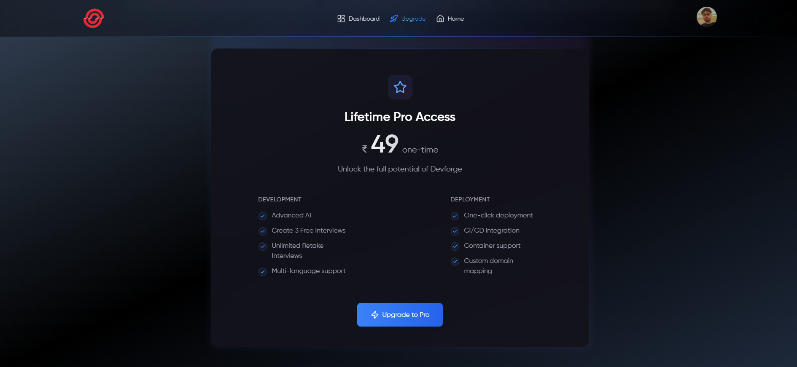
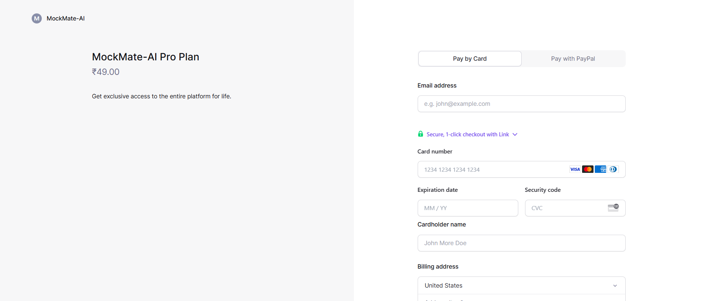
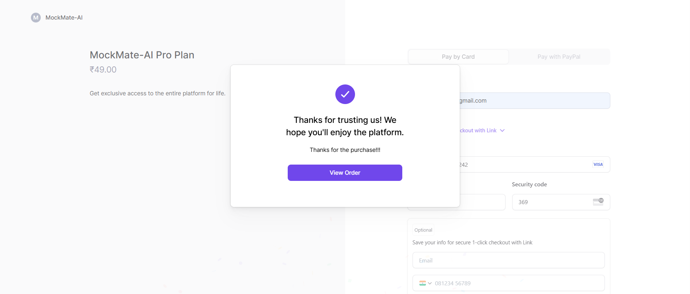

# MockMate-AI 🚀

## 🌟 Project Overview

A cutting-edge AI-powered mock interview platform designed to revolutionize interview preparation through advanced technology and intelligent feedback mechanisms.


<p align="center">
  <a href="https://mock-mate-ai-psi.vercel.app/">Demo app</a>
</p>

## 🔥 Key Features

### 🤖 AI-Powered Interview Generation
- Dynamically generates interview questions based on job roles
- Utilizes advanced AI to create context-specific questions
- Supports multiple tech stacks and experience levels

### 🎙️ Advanced Speech Recognition
- Real-time speech-to-text conversion
- Supports multiple languages
- Precise transcription with high accuracy

### 💡 Intelligent Feedback Mechanism
- AI-driven performance analysis
- Instant rating and detailed feedback
- Personalized improvement suggestions

### ❌ Delete Feature (New!)
- Users can delete past interview sessions
- Ensures privacy and control over data
- One-click deletion for convenience

### 🔒 Secure Authentication
- Seamless Clerk authentication
- User profile management
- Secure data handling

## 🛠 Tech Stack

### Frontend
- Next.js 14
- Tailwind CSS
- Shadcn UI
- Framer Motion
- Lucide React Icons

### Backend
- Drizzle ORM
- Gemini AI
- Speech Recognition API

### Authentication
- Clerk Authentication

### Payment Gateway
- Lemon Squeezy

### Deployment
- Vercel

## 🌈 UI/UX Highlights

- Futuristic, modern design
- Dark mode support
- Responsive across all devices
- Smooth, interactive animations
- Accessibility-focused components

## Flow Chart

## System Architecture (UML Class Diagram)


## 🚀 Getting Started

### Prerequisites
- Node.js (v18+)
- npm or yarn
- Gemini AI API Key
- Clerk Authentication Setup

### Installation

1. Clone the repository
```bash
git clone https://github.com/your-username/MockMate-AI.git
```

2. Install dependencies
```bash
cd mockmate-ai
npm install
```

3. Set up environment variables
```bash
# .env file
NEXT_PUBLIC_CLERK_PUBLISHABLE_KEY=
CLERK_SECRET_KEY=
NEXT_PUBLIC_CLERK_SIGN_IN_URL=/sign-in
NEXT_PUBLIC_CLERK_SIGN_UP_URL=/sign-up
NEXT_PUBLIC_DRIZZLE_DB_URL=
NEXT_PUBLIC_GEMINI_API_KEY=
NEXT_PUBLIC_INTERVIEW_QUESTION_COUNT=5
```

4. Run the development server
```bash
npm run dev
```

## 🔍 How It Works

1. User Authentication
   - Sign up/Login via Clerk
   - Create personalized profile

   

2. Interview Preparation
   - Select job role
   - Specify tech stack
   - Choose experience level

   
   
   

3. Mock Interview Process
   - AI generates contextual questions
   - Speech recognition captures answers
   - Real-time transcription
   
   
   
   

4. Delete Feature
   - Users can delete past interview sessions
   - Ensures privacy and control over data
   - One-click deletion for convenience
  
   
  
5. AI Generated Feedback
   - Instant AI feedback
   - Detailed analysis for each question
  
  
  
  

6. Pro Subscription Model
   - Implemented using LemonSqueezy
   - User will have access to unlimited mock interviews at reasonable price
  
  
  
  

## 🎥 Demo

[Watch Project Demo Video](link_to_demo_video)

## 🌟 Key Differentiators

- 100% AI-powered question generation
- Adaptive learning mechanism
- Privacy-first approach
- No stored video/audio recordings
- Completely browser-based

## 🔮 Future Roadmap

- Multi-language support
- More interview domains
- Advanced analytics dashboard
- Machine learning-based personalization
- Integration with job platforms

## 🤝 Contribution Guidelines

1. Fork the repository
2. Create your feature branch
3. Commit your changes
4. Push to the branch
5. Create a Pull Request

## 📊 Performance Metrics

- Lighthouse Score: 90+
- Accessibility: WCAG 2.1 Compliant
- Responsive Design: 100%
- Browser Compatibility: Chrome, Firefox, Safari, Edge

## 📜 License

This project is licensed under the MIT License.

## 🙌 Acknowledgements

- Gemini AI
- Clerk Authentication
- Lemon Squeezy Payment Gateway
- Next.js Community
- Tailwind CSS
- Open-source contributors

## 📞 Contact

Anindya Dolui
- LinkedIn: [Profile Link](https://www.linkedin.com/in/anindyadolui/)
- Email: aninxya07@gmail.com
- Portfolio: [My Portfolio Website](https://anindya-dolui.framer.website/)

Pragati Das
- LinkedIn: [Profile Link](https://www.linkedin.com/in/pragati-das-746270241/)
- Email: daspragati2910@gmail.com
- Portfolio: [My Portfolio Website](https://pragati-das.framer.website/)
---
